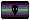
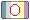
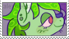
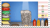
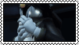
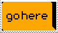
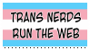
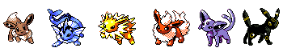

  

### butch - any pronouns - 22 - plural fagdyke

     

###

  

###

<b>lesboy: a lesbian with ties to the male identity, or a male who has a tie to the lesbian identity. the term lesboy may be new but male and masc lesbians have been in the lesbian community for all of documented queer history. be kind to your fellow queer siblings, exclusionism does nothing but harm all of us.</b>

###

 hi this is my funny poneytown account. i'm offtab 99% of the time, if i don't respond to you it's nothing personal!

       

i love: 

contradictory and good faith identities

<objectums

endo/non traumagenic systems

and people who self diagnose with proper research behind them 

idc about discourse much anymore but if you're self proclaimed "problematic" get away from me you're probably annoying as hell. also if you get off to incest/pedophilia/bestiality (fictional OR irl) you're a fucking weirdo stay away from me too

